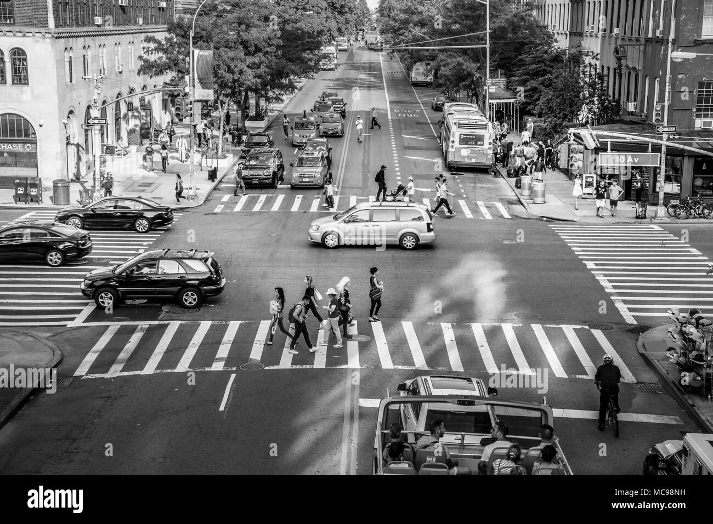
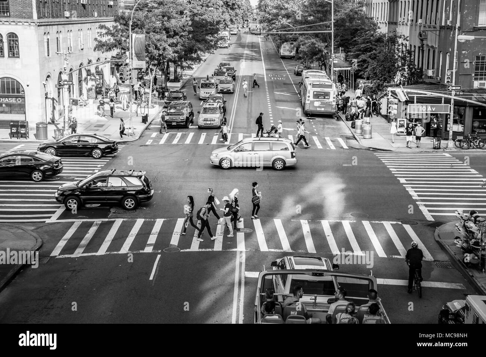
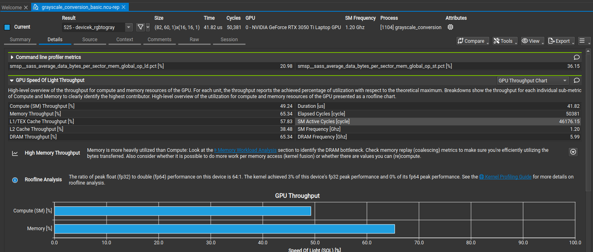
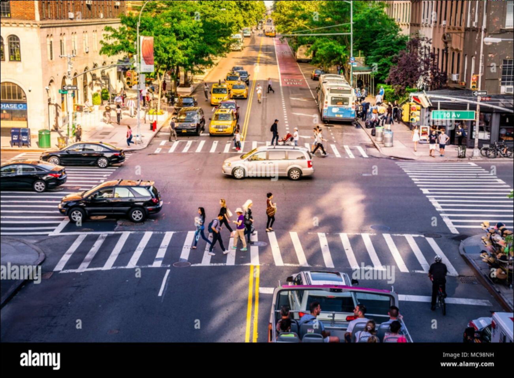
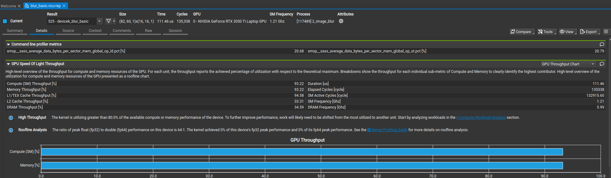
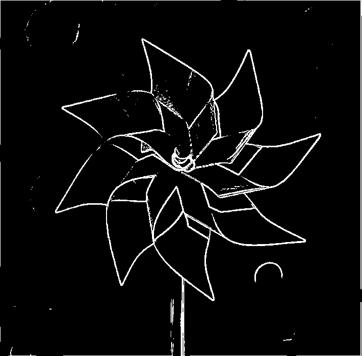
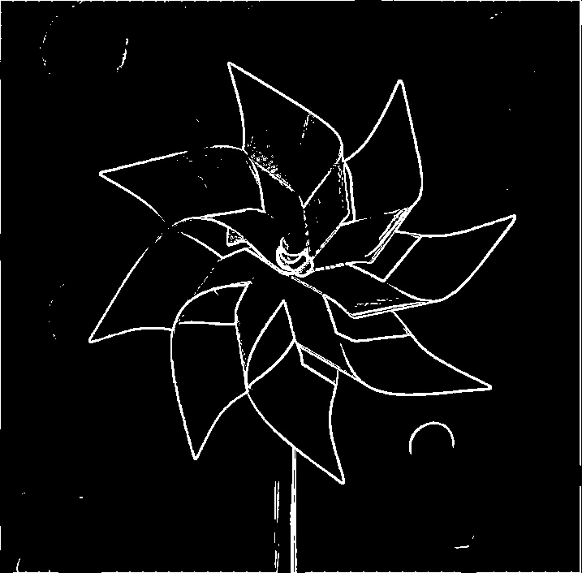

# Image Processing Results Summary

This document collects the saved outputs for the CUDA image-processing experiments in this folder. Inputs now live under `inputs/`, generated images under `outputs/`, and profiler screenshots under `profiles/`.

## 1. RGB to Grayscale

Source file: `1_grayscale_conversion.cu`

- Input image: `inputs/manhattan_traffic.jpg`
- Variants: host baseline, device basic kernel
- Recorded note: host `4.78 ms` vs device basic `2.18 ms`

| Input | Host Output |
| --- | --- |
|  |  |

| Device Basic |
| --- |
|  |

Profiler snapshot:

## 2. Image Blur

Source file: `2_image_blur.cu`

- Input image: `inputs/manhattan_traffic.jpg`
- Variant shown: basic blur kernel
- Recorded note: host `72.84 ms` vs device basic `3.83 ms`

| Input | Host Output |
| --- | --- |
|  |  |

| Device Basic Output | Nsight Compute Snapshot |
| --- | --- |
|  |  |

## 3. Edge Detection

Source file: `3_convolution.cu`

- Input image: `inputs/edgeflower.jpg`
- Variants shown: host baseline, device basic, device constant-memory, device tiled
- The kernel applies a Sobel-style gradient mask and writes a thresholded black-and-white edge image

| Input | Host Output |
| --- | --- |
|  |  |

| Device Basic | Device Constant Memory |
| --- | --- |
|  |  |

| Device Tiled |
| --- |
|  |

## Notes

- These results were generated on the author's local CUDA setup.
- The output images are kept here because they make the optimization path easier to compare visually.
- Raw profiler reports and local executables are intentionally not part of the result summary.
