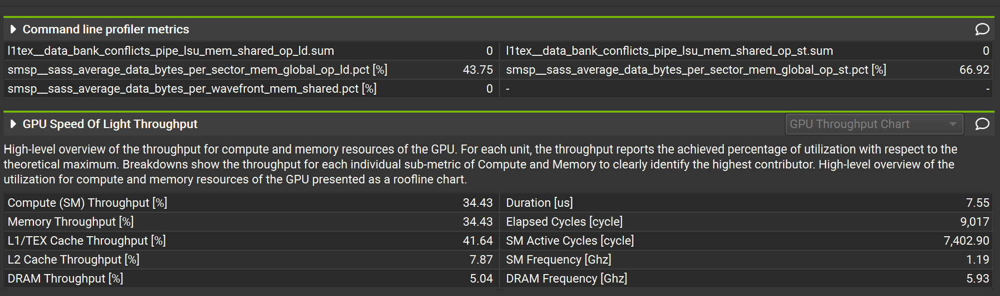
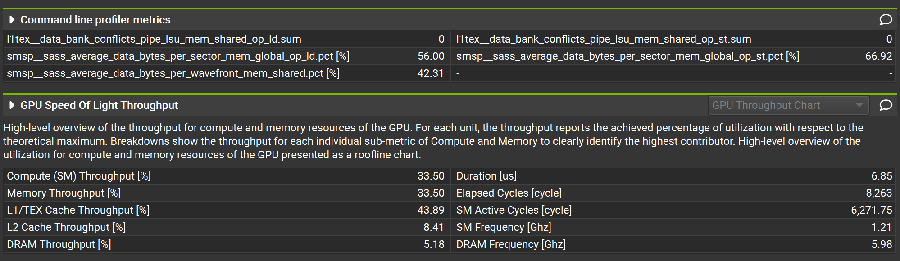
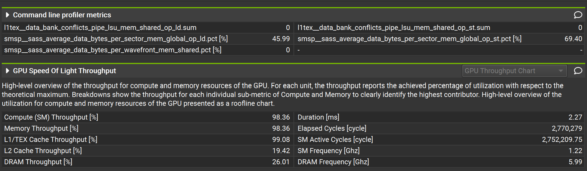
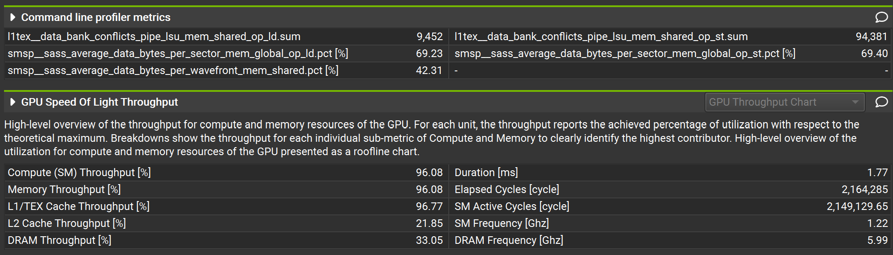
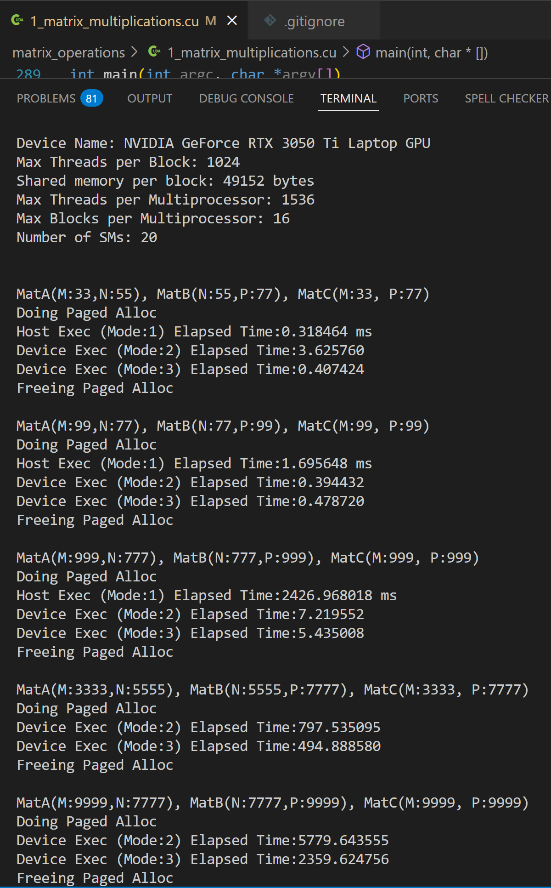

# Matrix Operations Results Summary

This document summarizes the matrix-oriented experiments in this folder using the checked-in timing notes and saved plots under `results/`.

## 1. Matrix Multiplication

Source file: `1_matrix_multiplications.cu`

Logged modes:

- Mode 1: host baseline
- Mode 2: device basic kernel
- Mode 3: device tiled kernel

Recorded timing summary:

| Matrix Shapes `(M, N, P)` | Host Mode 1 (ms) | Device Mode 2 (ms) | Device Mode 3 (ms) |
| --- | ---: | ---: | ---: |
| `(33, 55, 77)` | `0.318464` | `3.625760` | `0.407424` |
| `(99, 77, 99)` | `1.695648` | `0.394432` | `0.478720` |
| `(999, 777, 999)` | `2426.968018` | `7.219552` | `5.435008` |
| `(3333, 5555, 7777)` | not logged | `797.535095` | `494.888580` |
| `(9999, 7777, 9999)` | not logged | `5779.643555` | `2359.624756` |

Saved plots:

| Basic | Tiled |
| --- | --- |
|  |  |

| Basic Large | Tiled Large |
| --- | --- |
|  |  |

Test snapshot:

Summary:

- The host baseline is competitive only at the smallest logged case.
- Once the problem size grows, the GPU kernels win by a large margin.
- The tiled kernel becomes the stronger device variant at larger sizes, cutting the largest logged device run from `5779.64 ms` down to `2359.62 ms`.

## 2. 3D Stencil

Source file: `2_stencil_3d.cu`

Raw timing file: `results/timings/2_stencil_3d_times.txt`

Representative runs:

| Volume `(X, Y, Z)` | Host Basic (ms) | Device Basic (ms) | Device Tiled (ms) |
| --- | ---: | ---: | ---: |
| `(17, 17, 17)` | `2.538720` | `0.315744` | `0.284704` |
| `(113, 197, 159)` | `1974.259399` | `8.469856` | `7.370208` |
| `(313, 397, 359)` | `25714.300781` | `259.015137` | `201.688416` |
| `(713, 797, 759)` | `247662.937500` | `2084.486572` | `1538.908691` |

Summary:

- Even the basic GPU stencil beats the host implementation once the grid is moderately sized.
- The tiled stencil is consistently the best logged variant.
- The gap widens with scale: at `(713, 797, 759)`, the tiled kernel is about `135x` faster than the host baseline and materially faster than the untiled device version.

## 3. Work Present In Source But Missing Checked-In Result Logs

These kernels exist in the folder but do not yet have committed benchmark summaries in markdown or raw-text form:

- `3_spmv.cu`
- `4_graph_vc_bfs.cu`

Those are worth adding later once you decide which datasets, sparsity levels, and comparison modes you want to keep as the canonical results.
